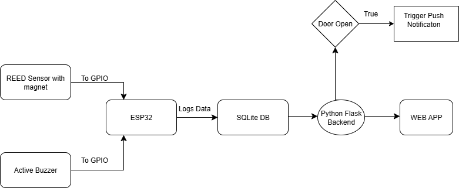

# 🚪 Smart Door Alert System (ESP32 + MySQL + Flask)

A door monitoring system using ESP32, a reed sensor, and an active buzzer. Logs entry events and alerts users via push notifications using a custom backend and web app.

---

## 🧠 Features
- Detects door status using reed sensor
- Active buzzer triggers when door opens
- ESP32 logs data to MySQL via Flask backend
- Push notifications sent to PWA and website
- Frontend built using HTML, CSS, and JavaScript

---

## 🔁 Flowchart

---

#Note:

This is a **summary-only** repo. The actual implementation is private.

🔒 To request access:
- Open an issue [here](https://github.com/yourusername/smart-door-alert-summary/issues/new?title=Request+for+code+access&body=Hi%2C+please+grant+me+access+to+the+private+code+repo+for+this+project.)
- Or email me at **vikas.vivekanathan@gmail.com**

---

## 🧰 Tech Used
- **ESP32** + Reed sensor + Active buzzer
- **Python Flask** backend
- **MySQL** database
- **HTML, CSS, JS** frontend
- Hosted using **Render**
